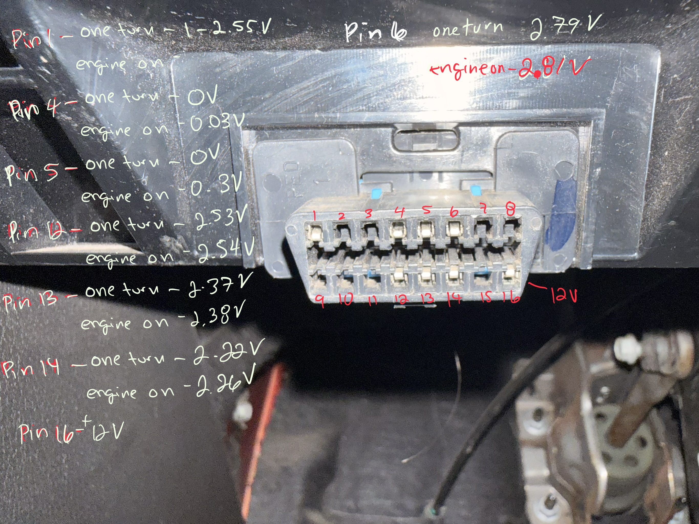

# 2012 Chevrolet Camaro 1LT — CAN Bus Reverse Engineering Project

A personal project to connect a Raspberry Pi 3 to a 2012 Chevrolet Camaro 1LT via OBD2, capture and analyze CAN bus traffic, and eventually control body functions (door locks) remotely via phone — without a key fob or subscription service.

---

## Project Goals

- [x] Understand CAN bus architecture and protocols
- [x] Identify OBD2 pin assignments on the physical connector
- [x] Map wire colors on iKKEGOL OBD2 breakout cable
- [x] Connect Raspberry Pi + Waveshare HAT to high speed GMLAN (Phase 4)
- [ ] Capture live CAN frames with candump
- [ ] Reverse engineer SWCAN body bus (Phase 5)
- [ ] Control door locks remotely from phone
- [ ] Build wake-on-demand system using ESP32
- [ ] Full phone-based remote control system

---

## Hardware

| Component | Model | Notes |
|---|---|---|
| Single board computer | Raspberry Pi 3 | Headless setup |
| CAN HAT | Waveshare 2-Channel Isolated CAN HAT (B087RJ6XGG) | MCP2515 controller + SN65HVD230 transceiver |
| OBD2 breakout cable | iKKEGOL 16-pin male breakout (B002EJ69CT) | All 16 pins connected, open wire ends |
| Soldering station | WEP 882D | Temperature controlled |
| Prototype PCB kit | Smraza 104pcs (B07NM68FXK) | For permanent build |
| SOIC-8 breakout board | Stargazer (B07R5QR9P3) | For TH8056 SWCAN transceiver chip |
| SWCAN transceiver | TH8056KDC-AAA-008-SP (Melexis) | Ordered from eBay — replacement for discontinued NCV7356 |

### Pending Orders
- TH8056KDC-AAA-008-SP x5 — eBay
- ESP32 development board — Amazon (Phase 6)
- 5V relay module — Amazon (Phase 6)
- 12V to 5V 3A buck converter — Amazon (Phase 6)

---

## Vehicle Architecture

### 2012 Chevrolet Camaro 1LT — Dual CAN Bus System

The Camaro uses GM's GMLAN protocol built on ISO 15765-2 (ISO-TP), consisting of two separate CAN buses:

```
┌─────────────────────────────────────────────────────┐
│           HIGH SPEED GMLAN (HS-CAN)                 │
│           500 kbps — OBD2 Pins 6 and 14             │
│           Max 16 nodes                              │
│                                                     │
│  ECM ── TCM ── ABS ── Instrument Cluster            │
│  (Engine) (Trans) (Brakes)                          │
└──────────────────┬──────────────────────────────────┘
                   │
                  BCM (Gateway)
                   │
┌──────────────────┴──────────────────────────────────┐
│           SINGLE WIRE CAN (SWCAN)                   │
│           33.333 kbps — OBD2 Pin 1                  │
│           Max 32 nodes                              │
│                                                     │
│  BCM ── Door Locks ── Windows ── HVAC               │
│  ── Interior Lighting ── Immobilizer                │
│  ── Mirrors ── Infotainment                         │
└─────────────────────────────────────────────────────┘
```

**Key architectural notes:**
- BCM acts as gateway between both buses
- Door locks and body control live on SWCAN — not accessible via standard OBD2 gateway
- Immobilizer lives on SWCAN — handles engine start authorization
- OnStar module (if equipped) connects to SWCAN and cellular network simultaneously
- OBD2 port exposes HS-CAN directly on pins 6/14 and SWCAN on pin 1

---

## OBD2 Connector — Standard Pinout

```
 ┌─────────────────────────────────┐
 │  1   2   3   4   5   6   7   8  │
 │  9  10  11  12  13  14  15  16  │
 └─────────────────────────────────┘
```

| Pin | Standard Function | GM/GMLAN Specific | Camaro Contains Pin |
|---|---|---|---|
| 1 | Manufacturer discretion | SWCAN (Single Wire CAN) — 33.333 kbps |
| 2 | SAE J1850 Bus+ | Unused on this vehicle |
| 3 | Manufacturer discretion | Unused |
| 4 | Chassis Ground | Chassis Ground |
| 5 | Signal Ground | Signal Ground |
| 6 | CAN High (J2284) | HS-GMLAN CAN-H — 500 kbps |
| 7 | K-Line ISO 9141 | Diagnostic K-Line |
| 8 | Manufacturer discretion | Unused |
| 9 | Manufacturer discretion | Unused |
| 10 | SAE J1850 Bus- | Unused on this vehicle |
| 11 | Manufacturer discretion | Unused |
| 12 | Manufacturer discretion | Possible medium speed GMLAN — under investigation |
| 13 | Manufacturer discretion | Possible medium speed GMLAN — under investigation |
| 14 | CAN Low (J2284) | HS-GMLAN CAN-L — 500 kbps |
| 15 | L-Line ISO 9141 | Diagnostic L-Line |
| 16 | Battery Positive (unswitched) | Always-on 12V |




---

## OBD2 Cable Wire Color Mapping

**Cable:** iKKEGOL 16-pin OBD2 male breakout  
**Note:** Wire colors DO NOT match the product description. Verified by direct multimeter measurement on both the cable wires and the physical OBD2 port pins.

### Verified by Multimeter — Direct Pin Measurement

| Pin | Wire Color | Accessory Voltage | Engine On Voltage | Function | Status |
|---|---|---|---|---|---|
| 1 | Red/white | 1–2.55V fluctuating | Active | SWCAN | Phase 5 — keep taped |
| 4 | Baby Blue | 0V | 0.03V | Chassis GND | ✅ Connect to HAT GND |
| 5 | Orange | 0V | 0.3V | Signal GND | ⚠️ Verify with continuity test |
| 6 | Green | 2.79V | 2.81V | CAN-H HS-GMLAN | ✅ Connect to HAT CAN-H |
| 12 | Pink | 2.53V | 2.54V | Unknown — possible MS-GMLAN CAN-H | 🔍 Investigate Phase 4 |
| 13 | Gray | 2.37V | 2.38V | Unknown — possible MS-GMLAN CAN-L | 🔍 Investigate Phase 4 |
| 14 | Green/white | 2.22V | 2.26V | CAN-L HS-GMLAN | ✅ Connect to HAT CAN-L |
| 16 | Red | 12V | 12V | Battery+ unswitched | ⚠️ DO NOT CONNECT — keep taped |

### Unconfirmed / Inactive Wires
| Wire Color | Voltage | Notes |
|---|---|---|
| Yellow | 0V | Inactive — manufacturer discretion pin |
| White | 0V | Inactive |
| Brown | 0V off / 1–2.55V on | Active when engine running — investigate |
| Baby | 0V | Inactive |
| Purple | 0V | Inactive |
| Black | 0V | Inactive |
| Brown/white | 0V | Inactive |                                                      
| Black/white | 0V | Inactive |

### ⚠️ Important Notes
- All unused wires taped off individually with electrical tape
- Pin 16 (Red — 12V) double taped — most dangerous wire on connector
- Pin 1 (Red/white — SWCAN) taped and labeled for Phase 5
- White wire (Pin 5) needs continuity test confirmation before connecting
- For door locks:
      Without a key fob you currently have no way to remotely lock or unlock your car at all.

      For remote start:
      This is more complex without a fob. The 2012 Camaro has an immobilizer that reads the transponder chip embedded in your metal key. When you insert the key and turn it the BCM reads that chip and authorizes the ECM to start. Without that physical key transponder present the car will not start even if you send the correct CAN frames.

      So remote start via CAN alone is not possible without solving the immobilizer challenge first. You have two options for that later:

      Option A — Keep the key in the car:
      Mount the metal key near the ignition permanently. The transponder is always present so the immobilizer is always satisfied. Your Pi just needs to send the ignition on CAN frames. Not the most secure but functional.

      Option B — Bypass the immobilizer:
      More complex, involves either cloning the transponder or sending the correct immobilizer authorization frames on SWCAN. This is advanced territory and a Phase 6 goal at earliest.

      The OnStar module has its own stored cryptographic token that the immobilizer recognizes as a valid authorization — essentially the OnStar module IS a permanent electronic key that lives inside the car
---

## Waveshare HAT — Connection Plan

**HAT:** Waveshare 2-Channel Isolated CAN HAT  
**Controllers:** 2x MCP2515  
**Transceivers:** 2x SN65HVD230 (differential CAN only — cannot do SWCAN)  
**Interface:** SPI to Raspberry Pi GPIO

### Phase 4 — HS-GMLAN Connection (Channel 1)

```
OBD2 Connector          Waveshare HAT
─────────────          ─────────────
Pin 6  (Green)    ───► Channel 1 CAN-H
Pin 14 (Grn/Wht)  ───► Channel 1 CAN-L
Pin 4  (Blue)     ───► GND
Pin 5  (White)    ───► GND

⚠️ Termination resistor jumper: DISABLE on HAT
   (Camaro already has termination — double termination causes errors)
⚠️ VIO jumper: Set to 3.3V (Pi GPIO is 3.3V logic)
```

### Phase 5 — SWCAN Connection (Channel 2) — FUTURE

```
OBD2 Connector          TH8056 Transceiver      Waveshare HAT
─────────────          ──────────────────      ─────────────
Pin 1 (Red/Wht)   ───► CANH pin          
                        TxD/RxD           ───► Channel 2 MCP2515
                        VCC               ◄─── 3.3V
                        VBAT              ◄─── 12V (from Pin 16)
                        GND               ◄─── GND

Note: TH8056 bypasses built-in SN65HVD230 transceiver on Channel 2
Note: SWCAN bus requires high voltage wakeup pulse before communication
```

---

## HAT Setup — Critical Configuration

Before connecting anything check these jumper settings on the Waveshare HAT:

1. **VIO jumper → 3.3V** — Pi runs 3.3V logic, wrong setting damages HAT
2. **Termination resistor → DISABLED** — car already has 120Ω termination at both ends
3. **SPI must be enabled** in `/boot/config.txt` or Raspberry Pi Imager settings

---

## Raspberry Pi Setup

**OS:** Raspberry Pi OS Lite 64-bit (fresh flash)  
**Hostname:** raspberry-car  
**Access:** SSH over WiFi 

### Flashing with Raspberry Pi Imager
1. Download Raspberry Pi Imager from `raspberrypi.com/software`
2. Select device: Raspberry Pi 3
3. Select OS: Raspberry Pi OS Lite 64-bit
4. Click settings gear and configure:
   - Hostname: `raspberry-car`
   - Enable SSH: yes
   - Username: your choice
   - Password: your choice
   - WiFi SSID and password
   - Country: US

### Software to Install (after SSH connection)
```bash
# Update system
sudo apt update && sudo apt upgrade -y

# Enable SPI in config
sudo raspi-config
# Interface Options → SPI → Enable

# Install CAN utilities
sudo apt install can-utils -y

# Install Python CAN library
pip install python-can --break-system-packages

# Bring up CAN interface
sudo ip link set can0 up type can bitrate 500000

# Test — start capturing frames
candump can0
```

---

## CAN Bus Concepts — Key Notes

### Why CAN Exists
Replaced hundreds of point-to-point wires in vehicles with a single shared two-wire bus. Every module connects to the same two wires and broadcasts messages with unique IDs. Every module listens to everything and filters for IDs it cares about.

### Differential Signaling
- CAN-H and CAN-L move in opposite directions simultaneously
- Recessive state: both at 2.5V, differential = 0V = bit 1
- Dominant state: CAN-H rises to 3.5V, CAN-L drops to 1.5V, differential = 2V = bit 0
- Receiver reads only the voltage difference — noise hits both wires equally and cancels out

### Arbitration
- All nodes transmit simultaneously, bit by bit
- Dominant 0 overrides recessive 1 on the wire
- Node that transmits 1 but reads back 0 lost arbitration — stops immediately
- Lower ID = more dominant 0 bits = higher priority
- No collision, no retransmission negotiation — resolves in microseconds at hardware level
- Similar to distributed systems leader election but implemented in hardware

### Frame Structure
```
SOF | Arbitration ID | Control | Data (0-8 bytes) | CRC | ACK | EOF
 1b |   11 or 29b    |   6b    |    0-64 bits     | 16b |  2b |  7b
```
- ID identifies message content, not destination — no addresses in CAN
- DLC field (4 bits in Control) specifies how many data bytes follow
- CRC and ACK handled entirely by MCP2515 hardware
- candump output format: `(timestamp) can0 ID#DATA`

### SWCAN vs Standard CAN
| | Standard CAN | SWCAN |
|---|---|---|
| Wires | 2 (CAN-H + CAN-L) | 1 + chassis ground |
| Signaling | Differential | Single wire voltage |
| Recessive | 2.5V differential | ~0V |
| Dominant | 2V differential | ~4V |
| Speed | 500 kbps (HS-GMLAN) | 33.333 kbps |
| Noise immunity | Excellent | Moderate |
| Wakeup | Always active | High voltage pulse (12V) |
| Transceiver | SN65HVD230 | TH8056 |
| Protocol | Identical CAN frames | Identical CAN frames |

### Important Discovery — Channel Mapping
Physical CAN0 terminal on HAT maps to `can1` in software, not `can0`.
Always use `can1` for the CAN0 terminal block connection.

Correct config.txt interrupt mapping:
- can0 (software) = CAN1 terminal (physical) = interrupt 23
- can1 (software) = CAN0 terminal (physical) = interrupt 25

Commands to bring up interface:
sudo ip link set can1 up type can bitrate 500000
candump can1
---

## Phase Roadmap

### Phase 1 — Foundations ✅ Complete
- CAN bus history and why it exists
- Differential signaling and termination
- OSI model mapping for automotive
- Read: TI Introduction to CAN (SLOA101B)

### Phase 2 — CAN Protocol ✅ Complete
- Frame structure byte by byte
- Non-destructive bitwise arbitration
- Error handling and fault confinement
- CAN FD overview
- Read: Car Hacker's Handbook Chapters 1-3

### Phase 3 — OBD2 and Diagnostics ✅ In Progress
- SAE J1979 OBD2 PIDs
- ISO 14229 UDS protocol
- Multi-bus vehicle architecture
- Read: Car Hacker's Handbook OBD2 chapter

### Phase 4 — Hardware Build ✅ In Progress
- Raspberry Pi OS fresh flash
- Waveshare HAT SPI configuration
- SocketCAN setup
- Connect to HS-GMLAN pins 6 and 14
- Run candump and capture live frames
- Investigate mystery pins 12 and 13

### Phase 5 — SWCAN Body Bus 📋 Planned
- Order and build TH8056 transceiver circuit
- Connect to SWCAN on pin 1
- Capture SWCAN traffic with candump
- Press door lock button inside car — capture frames
- Isolate door lock frame ID and payload
- Replay frames from Pi — verify door lock works

### Phase 6 — Remote Control System 📋 Planned
- ESP32 always-on wake module (powered from pin 16)
- 12V to 5V buck converter for Pi power
- Ignition-switched power via fuse tap
- REST API on Pi (Go backend)
- Phone app sends commands to Pi
- Wake on demand — ESP32 wakes Pi on command
- SWCAN wakeup pulse before sending commands
- Investigate remote start and immobilizer challenge

---

## Safety and Legal Notes

- This project is performed on a personally owned vehicle
- All CAN bus access is through the OBD2 port or direct wire tap
- No modification to vehicle safety systems (brakes, airbags, steering)
- Pin 16 (12V unswitched) is always taped off when not in use
- SWCAN commands tested in controlled environment only
- Remote start investigation deferred pending immobilizer research

---

## SWCAN Frame IDs — Community Research

### Source
GMLan Bible — community reverse engineered GM SWCAN frame database
Credit: Jesse (McJ) — tested on 2006 Holden VE SSV (GM platform)
Note: IDs should be consistent across GM platforms but node addresses
in 29-bit header may differ slightly on 2012 Camaro 1LT

---

### Door Lock Control — ARBID 0x004
Full 29-bit frame header: 080080B0
Data length: 2 bytes

| Command | Byte 1 | Byte 2 | cansend format |
|---|---|---|---|
| Lock all doors | 06 | 01 | 080080B0#0601 |
| Unlock driver only | 06 | 02 | 080080B0#0602 |
| Unlock all doors | 06 | 03 | 080080B0#0603 |
| Panic button | 06 | 0E | 080080B0#060E |

⚠️ Must be sent on SWCAN bus (can2) at 33.333 kbps — NOT high speed GMLAN
⚠️ Verify frame ID on your specific Camaro by sniffing SWCAN while
   pressing door lock button before sending commands

---

### Ignition Key State — ARBID 0x001
Full 29-bit frame header: 10002040
Data length: 4 bytes

| State | Bytes | Notes |
|---|---|---|
| Key Out | 00 00 74 77 | |
| Key In | 00 01 74 77 | |
| Key Accessory | 09 01 74 77 | |
| Key Run | 0A 01 74 77 | |
| Key Crank | 0B 01 74 77 | Engine cranking |
| Key Off | 08 01 74 77 | |

---

### Remote Start — ARBID 0x002
Full 29-bit frame header: 10004060
Data length: 1 byte
Command: FF

⚠️ EXTREME CAUTION — engine starts even without key in run position
⚠️ Cuts out after 500ms unless key is already in run position
⚠️ Do not test while in gear
⚠️ Needs further investigation before use
⚠️ Not confirmed on 2012 Camaro 1LT

---

### Radio Source — ARBID 0x174
Full 29-bit frame header: 102E8080
Data length: 2 bytes

| Source | Byte 1 | Byte 2 |
|---|---|---|
| AM | 04 | 02 |
| FM1 | 06 | 02 |
| FM2 | 08 | 02 |
| CD | 14 | 02 |

---

### Steering Wheel Controls — ARBID 0x068
Full 29-bit frame header: 100D0060
Data length: 4 bytes

| Button | Bytes |
|---|---|
| Mute | 20 00 00 00 |

---

### Key Notes on 29-bit Frame Structure
GM SWCAN uses 29-bit extended CAN IDs not 11-bit standard IDs.
The full 29-bit header encodes:
- The arbitration ID (message type)
- Source node address (who sent it)
- Destination node address (who should receive it)

When sending commands from your Pi use the full 29-bit header format.
Example cansend command for door lock:
```bash
cansend can2 080080B0#0601
```

When sniffing with candump look for the last digits matching
the arbitration ID — for door lock look for frames ending in 04
in the arbitration ID field.

---

### Hardware Required for SWCAN
- TH8056 transceiver chip — soldered on Stargazer SOIC-8 breakout ✅
- Standalone MCP2515 module (HW-184) — ordered ⏳
- Connected to Pi GPIO SPI1 pins — pending hardware arrival
- OBD2 pin 1 red/white wire — currently taped off, ready to connect

### SWCAN Software Setup
```bash
# Bring up SWCAN interface at 33.333 kbps
sudo ip link set can2 up type can bitrate 33333

# Sniff SWCAN traffic
candump can2

# Send door lock command
cansend can2 080080B0#0601

# Send door unlock command  
cansend can2 080080B0#0602
```

---
## High Speed GMLAN Frame Analysis — 2012 Chevrolet Camaro 1LT

### Capture Details
- Interface: can1 (physical CAN0 terminal on Waveshare HAT)
- Bitrate: 500 kbps
- Average frame rate: ~2,300 frames per second at idle
- Tool: candump -l can1

---

### Confirmed Frame IDs

#### RPM — Frame 0C9
- Bytes 2-3 contain engine RPM as a 16-bit integer
- Scaling factor: × 0.5
- Formula: `RPM = (byte2 << 8 | byte3) × 0.5`

| Condition | Raw bytes 2-3 | Decoded RPM |
|---|---|---|
| Idle | 0x0640 approx | ~800 RPM |
| 3000 RPM rev | 0x14F4 | ~2682 RPM |
| 3000 RPM rev | 0x14D8 | ~2668 RPM |

Example frame at 3000 RPM:

can1 0C9#8414F40700101800
^^^^
bytes 2-3 = 0x14F4 = 5364 × 0.5 = 2682 RPM


#### Coolant Temperature — Frame 18E (probable)
- Bytes 6-7 contain a slowly rising value as engine warms up
- Scaling factor: TBD — needs temperature correlation test
- Values rise gradually from cold start — consistent with coolant temp behavior

| Condition | Raw bytes 6-7 | Notes |
|---|---|---|
| Cold idle start | 0x0644 | Engine just started |
| Warm idle | 0x0754 | After ~90 seconds running |

#### ECM Heartbeat — Frame 0F1
- Broadcasts at highest rate — 6484 times in 65 seconds (~100 Hz)
- Byte 0 cycles through 4 states: 00, 1C, 28, 34
- This is a synchronization frame — not useful for sensor data

#### Status Frames — 0C7 and 0F9
- Both broadcast at ~80 Hz but data never changes
- 0C7 always: 03FE0000
- 0F9 mostly: 00004000000000FF
- These are likely mode or configuration status frames

---

### Frames Still To Identify
- Vehicle speed — need driving capture at known speed
- Throttle position
- Gear position
- Fuel level
- Brake pressure

---

### Python Decoding Example
```python
import can

bus = can.interface.Bus(channel='can1', bustype='socketcan')

while True:
    msg = bus.recv()
    
    # Decode RPM from frame 0C9
    if msg.arbitration_id == 0x0C9:
        raw = (msg.data[2] << 8) | msg.data[3]
        rpm = raw * 0.5
        print(f"RPM: {rpm:.0f}")
    
    # Decode coolant temp from frame 18E (scaling TBD)
    if msg.arbitration_id == 0x18E:
        raw = (msg.data[6] << 8) | msg.data[7]
        print(f"18E raw value: {raw} (temp scaling TBD)")
```

---

### Analysis Commands Used
```bash
# Count most frequent frame IDs
cat candump.log | awk '{print $3}' | cut -d'#' -f1 | sort | uniq -c | sort -rn | head -30

# Get unique values for specific frame ID
cat candump.log | grep " 0C9#" | awk '{print $3}' | sort | uniq -c | sort -rn | head -10

# Extract frames from specific time window
cat candump.log | awk '{if ($1 > "(timestamp1" && $1 < "(timestamp2") print $0}' | grep " 0C9#"
```
---

## Phase 5 — SWCAN Hardware Build Notes (HW-184 → TH8056 Bypass)

*Detailed build log for the SWCAN body-bus hardware work — HW-184 module modification, TH8056 transceiver wiring plan, and Pi-side connection plan. Paste this in after the existing "Phase 5 — SWCAN Body Bus" checklist section.*

### Wiring Diagram


*(hand-drawn diagram — pending, to be added)*

---

### HW-184 Board Identification

**Board:** WWZMDiB HW-184, MCP2515 + TJA1050 module, silkscreen rev "V2139"

| Reference | Component | Notes |
|---|---|---|
| U2 | MCP2515 | Marked "MCP2515 I/SO 23100TW", SPI CAN controller |
| U1 | TJA1050 | Marked "NXP TJA1050 CJ JH", SOIC-8, soldered SMD (not socketed) — high-speed CAN transceiver, incompatible with SWCAN |
| X1 | Crystal | Marked "8.000" — 8MHz oscillator |
| J4 | SPI header | 7-pin: VCC, GND, CS, SO, SI, SCK, INT |
| J1 | 3-pin jumper (near "POW" silkscreen) | Suspected power/logic-level select — **not independently confirmed**, no manual found for this board |
| J3 | 2-pin jumper (next to "L"/"H" silkscreen) | 120Ω termination resistor jumper — remove for SWCAN use |
| — | Blue 2-pin screw terminal | Standard CAN H/L output — not used for the SWCAN bypass |

### TJA1050 Removal — ✅ Complete

Standard TJA1050 SOIC-8 pinout (confirmed against [NXP's official datasheet](https://www.nxp.com/docs/en/data-sheet/TJA1050.pdf)):

| Pin | Signal |
|---|---|
| 1 | TXD |
| 2 | GND |
| 3 | VCC |
| 4 | RXD |
| 5 | VREF |
| 6 | CANL |
| 7 | CANH |
| 8 | S |

- Chip text read right-side-up in board photo → standard orientation → pin 1 = top-left leg, pin 4 = bottom-left leg (4 visible legs on chip's left edge).
- Removed via hot air (WEP 882D station): **330–350°C / 625–660°F**, low airflow setting, small/narrow nozzle to avoid heating nearby R1/R2/C1/C5.
- ⚠️ Learned the hard way: hot air spread far enough to start softening the plastic on the blue H/L screw terminal a few mm away. Fix was shielding nearby components (foil/Kapton) and keeping the nozzle closer + narrower rather than farther + wider.
- Full chip removed (not just lifted) to avoid the TxD/RxD nets being driven by two active outputs (TJA1050 + TH8056) simultaneously.
- Result: two clean exposed pads where U1 pin 1 (TXD) and pin 4 (RXD) were — these wire straight to MCP2515's TXCAN/RXCAN.

### TH8056 Pin Connections — 📋 Planned (chip mounted on Stargazer SOIC-8 breakout + green prototype PCB; resistor/cap network not yet soldered)

| Pin | Name | Connects to |
|---|---|---|
| 1 | TxD | HW-184 exposed TXD pad |
| 2 | MODE0 | 3.3V (Pi) — no component |
| 3 | MODE1 | 3.3V (Pi) — no component |
| 4 | RxD | HW-184 exposed RXD pad **+** 2.7kΩ pull-up resistor to 3.3V |
| 5 | VBAT | 1kΩ resistor in series → OBD2 pin 16 (12V) **+** 100nF cap from this junction to GND |
| 6 | LOAD | 5kΩ + 1kΩ resistors in series → GND (≈6kΩ total, per GMW3089 bus-loading spec) |
| 7 | CANH | OBD2 pin 1 (red/white wire) — the single wire into the car |
| 8 | GND | Common ground |

**Parts needed:** 4 resistors (2.7kΩ, 5kΩ, 1kΩ, 1kΩ) + 1 capacitor (100nF), sourced from ELEGOO Electronic Fun Kit.

### Pi → HW-184 SPI1 Wiring Plan — 📋 Planned

| Pi physical pin | Signal | HW-184 J4 pin |
|---|---|---|
| Pin 2 | 5V | VCC |
| Pin 6 | GND | GND |
| Pin 38 (GPIO20) | MOSI | SI |
| Pin 35 (GPIO19) | MISO | SO |
| Pin 40 (GPIO21) | SCK | SCK |
| Pin 36 (GPIO16) | CS | CS |
| Pin 37 (GPIO26) | INT | INT |
| Pin 1 (3.3V) | Logic ref | → TH8056 pins 2 & 3, and RxD pull-up (not HW-184 directly) |

config.txt (already documented above in Phase 5 software section):
```
dtoverlay=spi1-1cs
dtoverlay=mcp2515,spi1-0,oscillator=8000000,interrupt=26
```

### Waveshare HAT — Compatibility Check for Adding HW-184

- Waveshare 2-CH CAN HAT uses **SPI0** (GPIO 7, 8, 9, 10, 11, 22/23, 24/25) — confirmed via [Waveshare's own wiki](https://www.waveshare.com/wiki/2-CH_CAN_HAT). No pin conflict with HW-184's planned **SPI1** pins (GPIO 16, 19, 20, 21, 26).
- Confirmed via board photo: the HAT has a full 40-pin GPIO **passthrough/stacking header** — every Pi GPIO pin, including the SPI1 set, is physically accessible on top of the installed HAT.
- HAT also has a side single-row breakout header (INT1/INT0/CS1/CS0/SCK/MOSI/MISO/GND/5V) — this exposes **SPI0** (the HAT's own two channels) plus power; convenient for grabbing 5V/GND but not usable for HW-184's SPI1 signal lines.
- **PWR jumper (3V3 / VIO / 5V):** sets the logic-level reference for the HAT's SPI signals. Confirmed via Waveshare wiki: *"Onboard voltage translator, select 3.3V/5V operating voltage by jumper"* and *"we need to set the VIO of 2-CH CAN HAT to 3.3V"* for Raspberry Pi use.
  - Verified in person: jumper is bridging **3V3–VIO**, which is the correct setting (Pi GPIO is 3.3V logic, not 5V tolerant).
- **Recommended physical method for the new SPI1 wires:** a Raspberry Pi GPIO screw-terminal breakout board (plugs onto the passthrough header, no soldering) for the 5 SPI1 signal pins, since the passthrough pins are small and closely spaced. Plain female-to-female jumper wires can connect HW-184's J4 header directly (it's already a male pin header) — no soldering needed there either.

### Power Domains — Don't Cross These

Two separate, unrelated supplies feed into this circuit:
1. **3.3V logic reference** (from Pi) → TH8056 MODE0, MODE1, RxD pull-up. Tells the chip what voltage counts as digital HIGH.
2. **12V raw battery** (from OBD2 pin 16, through a 1kΩ resistor) → TH8056 VBAT. Actually powers the chip and lets it drive the SWCAN bus.

All grounds (Pi, HW-184, TH8056 pin 8, OBD2 pins 4 & 5) tie to one common ground rail.


## References and Resources

| Resource | URL | Notes |
|---|---|---|
| TI Introduction to CAN | ti.com/lit/an/sloa101b/sloa101b.pdf | Physical layer — Phase 1 reading |
| CSS Electronics CAN intro | csselectronics.com | Best practical CAN tutorials |
| Kvaser CAN protocol | kvaser.com/about-can | Protocol deep dive |
| Linux SocketCAN docs | kernel.org/doc/html/latest/networking/can.html | Kernel driver reference |
| Waveshare HAT wiki | waveshare.com/wiki/2-CH_CAN_HAT | Setup guide for your specific HAT |
| python-can docs | python-can.readthedocs.io | Python CAN library |
| opendbc | F | Open vehicle DBC files |
| can-utils | github.com/linux-can/can-utils | candump cansend cansniffer |
| Car Hacker's Handbook | opengarages.org/handbook | Main project reference book |
| Bit timing calculator | bittiming.can-wiki.info | MCP2515 CNF register calculator |
| TH8056 datasheet | melexis.com | SWCAN transceiver reference |
|BCM as Gateway Module| https://www.vehicleservicepros.com/service-repair/diagnostics-and-drivability/article/21252019/when-theres-no-wake-up-call | This article talks about an issue they are having witht he communication CAN bus |
| Single Wire CAN Network Diagnosis -GM SWCAN | https://diag.net/msg/m1x0xyytrtjas33qio6if5ukhm | coming soon | 
|GMLAN Bible- GM SWCAN Frame ID Database| https://carmodder.com/viewtopic.php?t=24143 | coming soon |
| Lets Talk GMLAN - SWCAN Bus Disscussion| https://ls1tech.com/forums/pcm-diagnostics-tuning/1620295-lets-talk-gmlan-j2411-swcan-bus.html | coming soon |
| TJA1050 datasheet (NXP) | https://www.nxp.com/docs/en/data-sheet/TJA1050.pdf | |
| 2-CH CAN HAT wiki (Waveshare) | https://www.waveshare.com/wiki/2-CH_CAN_HAT | coming soon |
| TH8056 datasheet (Melexis) | melexis.com — see main hardware doc | coming soon |
| SPI protocol overview | https://learn.sparkfun.com/tutorials/serial-peripheral-interface-spi/all | coming soon |
| Logic levels overview | https://learn.sparkfun.com/tutorials/logic-levels/all | coming soon |


---

## Project Log

| Date | Milestone |
|---|---|
| 2026-08-13 | Identified HW-184 board layout via photo — U2=MCP2515, U1=TJA1050, X1=8MHz crystal, J4 SPI header, J1 (unconfirmed jumper), J3 (termination jumper) |
| 2026-08-13 | Confirmed TJA1050 pinout against NXP datasheet — pin 1 TXD, pin 4 RXD identified as bypass points |
| 2026-08-13 | Desoldered U1 (TJA1050) from HW-184 using WEP 882D hot air station (330–350°C, low airflow) — exposed clean TXD/RXD pads |
| 2026-08-13 | Confirmed Waveshare HAT has 40-pin GPIO passthrough header + verified PWR jumper is correctly set to 3.3V (3V3–VIO bridged) |
| 2026-08-13 | Finalized full wiring plan: Pi → HW-184 (SPI1) → TH8056 → OBD2 pin 1, with separate 3.3V logic and 12V VBAT supplies |
| 2026-08-06 | Found GMLan Bible SWCAN frame IDs for door lock ARBID 0x004 |
| 2026-08-06 | Confirmed door lock payload: 0601 lock, 0602 unlock driver, 0603 unlock all |
| 2026-08-06 | Found potential remote start frame ARBID 0x002 — needs verification |
| 2026-07 | Started project — read TI CAN intro document |
| 2026-07 | Studied Car Hacker's Handbook Chapters 1-3 |
| 2026-07 | Identified all 16 OBD2 wire colors with multimeter |
| 2026-07 | Confirmed CAN-H (green) and CAN-L (green/white) |
| 2026-07 | Discovered mystery pins 12/13 — possible second CAN bus |
| 2026-07-29 | Ordered TH8056 SWCAN transceiver from eBay |
| 2026-07-28 | Flashing fresh Raspberry Pi OS — in progress |
| 2026-07-28 | Connected Waveshare HAT to Camaro OBD2 port |
| 2026-07-28 | Discovered can0/can1 channels were swapped in software — CAN0 terminal maps to can1 |
| 2026-07-28 | Successfully captured live CAN frames with candump — ~1310 frames/second at idle |
| 2026-07-28 | Captured idle and revving log files for frame analysis |
| 2026-07-28 | Phase 4 hardware connection confirmed working |
